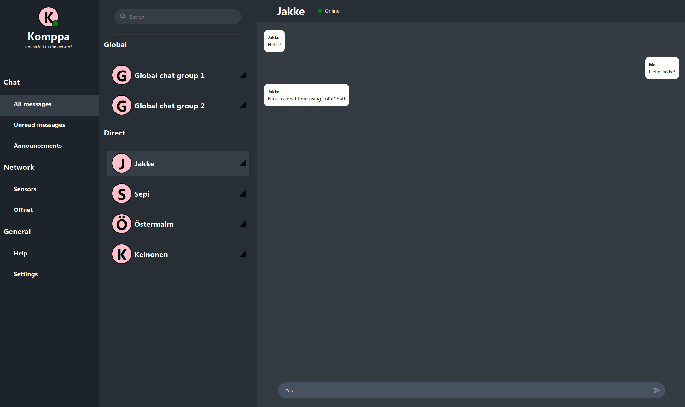

# LoRaChat

LoRaChat is a project that uses LoRa radios to create a mesh network, allowing you to chat with your friends without relying on traditional communication infrastructure like cellular networks or the internet. LoRaChat is perfect for remote locations, off-grid communication, or just for the fun of building and using a decentralized communication system.

<br></br>

<br></br>

## Project Structure

This repository consists of two main directories:

- `web`: This directory contains the web-based user interface built with React, which enables users to chat with each other through the LoRaChat network.
- `firmware`: This directory contains the firmware for the microcontroller unit (MCU) with the LoRa radio. The firmware is responsible for creating a Wi-Fi network that users can connect to in order to access the LoRaChat network. It also handles the routing of packets within the mesh network.

## Getting Started

Follow these steps to set up and use LoRaChat:

### Hardware Requirements

- ESP32 with Wi-Fi capabilities (e.g., Heltec ESP32 WiFi LoRa v2)

### Software Requirements

- [Node.js](https://nodejs.org/) and [npm](https://www.npmjs.com/) for building and running the web user interface
- A suitable Integrated Development Environment (IDE) and toolchain for your chosen MCU (but preferrably PlatformIO)

### Setup

Clone this repository to your local machine.

```bash
git clone https://github.com/komppa/LoRaChat_v4.git
```

Navigate to the firmware directory.
Compile and upload the firmware to your MCU.

## Running the Web User Interface on your local machine

Navigate to the web directory.

```bash
cd LoRaChat/web
```

Install the required dependencies.

```bash
npm install
```

Start the UI development server.
```bash
npm run start
```

Open your browser and navigate to http://localhost:3000 to access the web user interface.
Connect to the Wi-Fi network created by the LoRaChat firmware, and start chatting with your friends!

## Compilating the firmware

Navigate to the firmware directory.

```bash
cd LoRaChat/firmware
```

Install the required dependencies.

```bash
platformio run -e heltec_wifi_lora_32_V2    # For compiling real hardware
platformio run -e wokwi_simulation          # For compiling Wokwi simulator
```

## Contributing

We welcome contributions to improve and expand the capabilities of LoRaChat. If you would like to contribute, please feel free to submit a pull request or open an issue on GitHub.